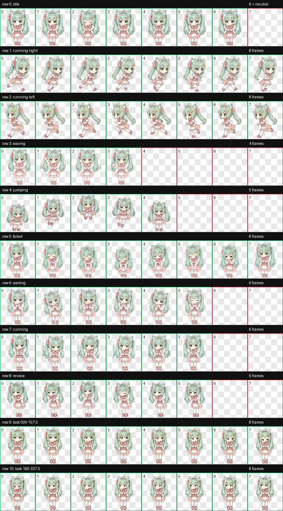

# 葱喵（Congmiao）Codex 桌宠

葱喵是一只为 Codex 制作的 v2 动画桌宠：薄荷绿猫耳双马尾、绿色眼睛、粉白女仆裙，性格甜美、温柔、认真，并带一点猫系活力。



## 特性

- Codex v2 精灵图格式
- `8 × 11` 布局，单格 `192 × 208`
- 精灵图总尺寸 `1536 × 2288`
- 包含 9 组标准动作：待机、左右移动、挥手、跳跃、失败、等待、处理中和审查
- 包含完整 16 向视线动画
- WebP 透明背景

## 安装

### 方法一：克隆仓库

```bash
git clone https://github.com/YoisakiKnd/congmiao-codex-pet.git
mkdir -p ~/.codex/pets/congmiao
cp congmiao-codex-pet/pet.json congmiao-codex-pet/spritesheet.webp ~/.codex/pets/congmiao/
```

### 方法二：手动安装

下载仓库中的以下两个文件：

- `pet.json`
- `spritesheet.webp`

将它们放入：

```text
~/.codex/pets/congmiao/
```

重新打开 Codex 后，在桌宠选择中启用「葱喵」。

## 文件说明

```text
.
├── pet.json                 # Codex 桌宠配置
├── spritesheet.webp         # 8×11 v2 动画精灵图
└── previews/
    ├── contact-sheet.png    # 完整动作联系表
    └── look-directions.png  # 16 向视线检查图
```

## 配置

```json
{
  "id": "congmiao",
  "displayName": "葱喵",
  "spriteVersionNumber": 2,
  "spritesheetPath": "spritesheet.webp"
}
```

## 角色设计

角色以薄荷绿猫耳双马尾、绿色眼睛、粉白女仆裙、粉色蝴蝶结、金色星形发夹和黑色耳麦为核心特征。动画针对桌宠尺寸简化了服装细节，并缩短、加粗双马尾，以确保小尺寸播放时轮廓清楚且动作稳定。

## 使用说明

本仓库提供 Codex 桌宠素材与配置。角色图片的再分发、修改或商业使用，请先取得仓库作者许可。
